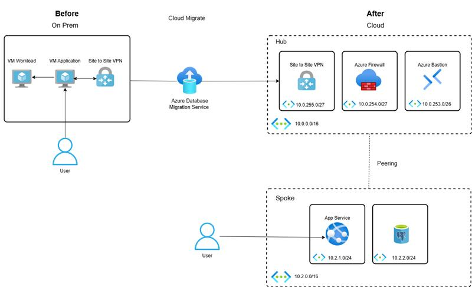

# 🌐 Linux Workload Migration to Azure using Terraform - Hub-Spoke Architecture

[](https://azure.microsoft.com/) [](https://learn.microsoft.com/en-us/azure/postgresql/) [](https://learn.microsoft.com/en-us/azure/bastion/bastion-overview) [](https://learn.microsoft.com/en-us/azure/firewall/overview) [](https://learn.microsoft.com/en-us/azure/vpn-gateway/)

---

## 📘 Project Description

This project demonstrates the migration of Linux-based workloads from an on-premises network to Azure using a modular **Hub-Spoke** architecture deployed entirely through **Terraform**. The scenario includes:

* Creating on-prem, hub, and spoke environments
* Migrating a PostgreSQL database to Azure Database for PostgreSQL Flexible Server
* Hosting a web application in an Azure App Service
* Configuring site-to-site VPN between on-prem and Azure hub
* Enabling DNS resolution, private endpoints, Bastion access, and firewall protection

---

## 🖼️ Architecture Diagram



---

## 🗂️ Terraform Module Structure

Each component (e.g., virtual network, VM, Bastion, VPN, NSG) is deployed using reusable modules stored under `../Modules/`.

---

## 🏗️ Network Topology

* **Hub**: Centralized network in Azure with Firewall, VPN Gateway, Bastion
* **Spoke**: Contains App Service, PostgreSQL Flexible Server, Private DNS
* **On-Prem**: Simulated local environment with Linux VMs and VPN Gateway

```
On-Prem    <--->    Azure Hub    <--->    Spoke VNet
(Linux VMs)         (Firewall, VPN)        (App, DB)
```

---

## 🛠️ Deployment Breakdown

### 🔹 Hub Deployment

* Creates `Hub-Vnet` with subnets:

  * `GatewaySubnet` for VPN Gateway
  * `AzureFirewallSubnet` for Azure Firewall
  * `AzureBastionSubnet` for secure RDP/SSH
* Public IPs for VPN, Firewall, and Bastion
* Deploys:

  * Azure Firewall with Firewall Policy
  * Azure Bastion Host
  * Azure VPN Gateway (Sku: VpnGw2, BGP enabled)
* VPN Connection to on-prem site using shared key

### 🔹 Spoke Deployment

* Creates `spoke-vnet` with subnets:

  * `app_subnet`: Web App Service
  * `postgresql_subnet`: Azure PostgreSQL
* VNet Peering to Hub
* Deploys:

  * Azure Database for PostgreSQL Flexible Server
  * Private DNS Zone: `privatelink.postgres.database.azure.com`
  * Private Endpoint for PostgreSQL
  * Azure App Service Plan (Linux, Basic B1)
  * Azure App Service (.NET 6.0)

### 🔹 On-Prem Deployment

* Simulates on-prem VNet `onprem-vnet` with:

  * Two subnets for VMs
  * GatewaySubnet for VPN
  * AzureBastionSubnet
* Deploys:

  * Two Linux VMs with public IPs
  * VPN Gateway with public IP
  * NSG for HTTP (80) and PostgreSQL (5432)
  * NSG association to both VM subnets
  * VPN Site-to-Site Connection to Azure Hub
  * Bastion for secure access
* Executes shell script to simulate workload (`PG-workload-install.sh`)

---

## 🔐 Security Features

* Azure Firewall in the hub controls traffic across all networks
* NSG applied to subnets for fine-grained control
* Private Endpoint ensures secure database access
* Bastion access used for secure VM connection without public exposure
* Shared VPN secret ensures secure communication

---

## 🔄 DNS and Private Access

* DNS zone `privatelink.postgres.database.azure.com` created
* Linked with spoke VNet for private name resolution
* Private Endpoint ensures DB is not exposed publicly

---

## 💡 Highlights

* 🔁 **Modular Terraform Design** – Clean separation of components for reusability
* 🔐 **End-to-End Security** – Firewalls, NSG, Bastion, Private Link
* 🌉 **Hybrid Connectivity** – VPN bridging on-prem and Azure seamlessly
* 🧩 **Fully Automated Setup** – Infrastructure as Code

---


## 🚀 Getting Started

```bash
# Clone the repository
$ git clone https://github.com/terraform-azure-linux-windows-migration

# Navigate to linux working directory
$ cd terraform-linux

## Navigate to windows working directory
$ cd terraform-windows

# Initialize Terraform
$ terraform init

# Validate configuration
$ terraform validate

# Apply configuration
$ terraform apply
```

---
## 👨‍💻 Author
| Name                     | Role                        | LinkedIn                                                                  |
| ------------------------ | --------------------------- | ------------------------------------------------------------------------- |
| **Aflal Ahmad**          | Cloud Engineer @ CloudSlize | [aflalahmadav](https://www.linkedin.com/in/aflalahmadav/)                 |
| **Mohamed Uwaisudeen**   | Cloud Engineer @ CloudSlize | [mduwaisudeen](https://www.linkedin.com/in/mduwaisudeen/)                 |
| **Alfareed Bin Alameen** | Cloud Engineer @ CloudSlize | [alfareed-bin-alameen](https://www.linkedin.com/in/alfareed-bin-alameen/) |


## 🙏 Feedback

Was this documentation helpful?
[](#) [](#)

---

<div align="center">

[](#)

</div>
