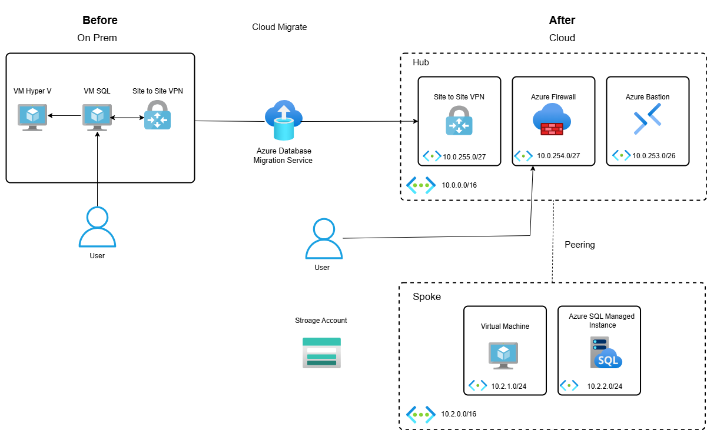

# 🪟 Windows Workload Migration to Azure using Terraform - Hub-Spoke Architecture

[](https://azure.microsoft.com/)  
[](https://learn.microsoft.com/en-us/azure/azure-sql/)  
[](https://learn.microsoft.com/en-us/azure/migrate/)  
[](https://learn.microsoft.com/en-us/azure/bastion/)  
[](https://learn.microsoft.com/en-us/azure/firewall/)

---

## 📘 Project Description

This project demonstrates the **secure migration of Windows Server and SQL Server workloads** from an on-premises network to Azure using a **Hub-Spoke network topology** and **Terraform**.  
It closely follows Microsoft's best practices for hybrid connectivity, governance, and security.

> ✅ The project uses infrastructure-as-code to deploy foundational services (network, firewall, Bastion), simulate on-premises workloads, and migrate SQL data.

---

## 🖼️ Architecture Diagram



---

## 🗂️ Terraform Structure

Each resource is deployed via modular Terraform code stored in the `../Modules/` directory for reusability and clarity.

---

## 🏗️ Network Topology

* **Hub**: Shared Azure resources like Firewall, VPN Gateway, Bastion  
* **Spoke**: Hosts Windows workload VMs and Azure SQL  
* **On-Prem**: Simulated on-premises network with domain controller and Windows file server

```
On-Prem    <--->    Azure Hub    <--->    Spoke VNet
(AD, VM)            (Firewall, VPN)       (Windows VM, Azure SQL)
```

---

## 🛠️ Deployment Breakdown

### 🔹 Hub Deployment

* Creates `hub-vnet` with:
  - `GatewaySubnet` (VPN)
  - `AzureFirewallSubnet`
  - `AzureBastionSubnet`
* Deploys:
  - **VPN Gateway** with BGP and shared key
  - **Azure Firewall** with custom policy (RDP/SQL allowed)
  - **Azure Bastion** for secure access without public IPs
* Peered with spoke and on-prem networks

### 🔹 Spoke Deployment

* Creates `spoke-vnet` with subnets:
  - `vm_subnet`: for migrated Windows Server VM
  - `sql_subnet`: for Azure SQL deployment
* Deploys:
  - **Windows Server 2022 VM** with IIS & RDP enabled via extension
  - **Azure SQL Database**
  - **Private Endpoint** to SQL with DNS resolution
  - **NSGs** for limited RDP/SQL access via firewall

### 🔹 On-Prem Deployment (Simulated)

* Creates `onprem-vnet` with:
  - Subnets for:
    - **AD Domain Controller VM**
    - **Windows File Server VM**
  - `GatewaySubnet` for VPN
  - `AzureBastionSubnet`
* Deploys:
  - Domain Controller configured via script
  - File Server to simulate legacy workloads
  - VPN Gateway with Site-to-Site to Azure Hub
  - Bastion for secure access

---

## 🔐 Security Features

* 🔥 **Azure Firewall** governs cross-network access
* 🔒 **NSGs** applied at subnet level (only RDP, SQL, HTTP)
* 🔐 **Private Endpoints** for Azure SQL
* 🧱 **No Public IPs on VMs** – Bastion used for access
* 🔑 **Site-to-site VPN** with shared key and IPsec

---

## 🔄 DNS & Private Access

* **Private DNS Zone** for `privatelink.database.windows.net`
* Auto-linked to spoke VNet
* Azure SQL Database is only reachable via private link

---

## 💡 Highlights

* 🧩 **Modular Terraform Design** – All core services are reusable
* 🛡️ **Security Best Practices** – No public exposure of workloads
* 🔁 **Hybrid Cloud Connectivity** – VPN between on-prem and Azure
* ⚙️ **Fully Automated Provisioning** – One-click `terraform apply`

---

## 🚀 Getting Started


```bash
# Clone the repository
$ git clone https://github.com/aflalahmad/terraform-azure-linux-windows-migration

# Navigate to linux working directory
$ cd terraform-linux

## Navigate to windows working directory
$ cd terraform-windows

# Initialize Terraform
$ terraform init

# Validate configuration
$ terraform validate

# Apply configuration
$ terraform apply
```

---
## 🧪 Workload Simulation

* `scripts/install-iis.ps1` – installs IIS role in Windows VM
* `scripts/setup-ad.ps1` – sets up basic AD DS roles on DC
* `scripts/sql-migration.ps1` – mocks database migration to Azure SQL

---

## 👨‍💻 Authors

| Name                   | Role                        | LinkedIn                                                                  |
|------------------------|-----------------------------|---------------------------------------------------------------------------|
| **Aflal Ahmad**        | Cloud Engineer @ CloudSlize | [aflalahmadav](https://www.linkedin.com/in/aflalahmadav/)                 |
| **Mohamed Uwaisudeen** | Cloud Engineer @ CloudSlize | [mduwaisudeen](https://www.linkedin.com/in/mduwaisudeen/)                 |
| **Alfareed Alameen**   | Cloud Engineer @ CloudSlize | [alfareed-bin-alameen](https://www.linkedin.com/in/alfareed-bin-alameen/) |

---

## 🙏 Feedback

Was this documentation helpful?

[](#) [](#)

---

<div align="center">
  
[](#)

</div>